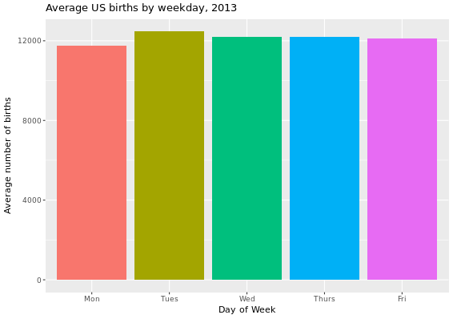

# Further Tasks {-}

The tasks below should be answered by creating your own .R script file (hence no inbuilt R consoles are included below).  Start by opening **RStudio** from the "Maths-Stats" folder on your desktop and then create a new R script by going to `File -> New File -> R Script`. Save this file as **DAWeek2.R** in your personal drive, either M: or K: - **(NB. DO NOT save it to the H: drive)**.  The first step is to load into R all of the libraries you will need. This can be done by typing (or copying and pasting!) the following into your R script:

```{r libraries0, echo = TRUE, eval = TRUE, warning = FALSE}
library(dplyr)
library(tidyr)
library(ggplot2)
library(nycflights13)
library(readr)
library(knitr)
library(fivethirtyeight)
library(stringr)
```

The libraries can be loaded into R by highlighting them in your script and then clicking on the `Run` button located in the top right of the script window.

<br>

**Task 1**

In this task we will work with the data set analysed and reported in the 2016 article from FiveThirtyEight.com entitled "Some People Are Too Superstitious To Have A Baby On Friday The 13th" [here](https://fivethirtyeight.com/features/some-people-are-too-superstitious-to-have-a-baby-on-friday-the-13th/).

The data set is called `US_births_2000_2014` and is in the `fivethirtyeight` package.

1.	Create an object called `US_births_2013` which focuses only on data corresponding to 2013 births. 

2.	By only choosing births data for the years 2010, 2011, 2012, and 2014 create a new data frame called `US_births_small` and check that this resulting data frame has 1461 rows.   Note that there are many different ways to do this, but try and come up with three different ways using: 
    - the "or" operator `|`
    - the `%in%` operator
    - the "not" operator `!`
  
    or combinations of them.

3.	Suppose we are interested in choosing rows for only weekdays (not Saturdays or Sundays) for `day_of_week` in year 2013.  Write the code to do so and give the name `US_births_weekdays_2013` to the resulting data frame. (Note that you may want to run `US_births_2000_2014 %>% distinct(day_of_week)` to identify the specific values of `day_of_week`.)

4.	Using what you covered in **Week 1: Visualization**, produce an appropriate plot looking at the pattern of births on all weekdays in 2013 coloured by the particular day of the week.  (Remember to load the package `ggplot2`).

5.	The plot in the previous task has shown there are some outliers in the data for US births on weekdays in 2013. We can use the summarize function to get an idea for how these outliers may affect the shape of the births variable in `US_births_weekdays_2013`.  Write some code to calculate the mean and median values for all weekday birth totals in 2013. Store this aggregated data in the data frame `birth_summ`.  What do these values suggest about the effects of the outliers?

6.	Instead of looking at the overall mean and median across all of 2013 weekdays, calculate the mean and median for each of the five different weekdays throughout 2013. Using the same names for the columns as in the `birth_summ` data frame in the previous exercise, create a new data frame called  `birth_day_summ`.

7.	Using the aggregated data in the `birth_day_summ data` frame, produce this barplot.

```{r FT1, echo=FALSE,  purl=FALSE, out.width = "400px", fig.pos="h"}

```

<br>

**Task 2**
In this task we will work with the data set analysed and reported in the 2014 article from FiveThirtyEight.com entitled "41 Percent Of Fliers Think You're Rude If You Recline Your Seat" [here]( 
https://fivethirtyeight.com/features/airplane-etiquette-recline-seat/).

The data set is called `flying` and is in the `fivethirtyeight` package.

1.	Write code to determine the proportion of respondents in the survey that responded with "Very" when asked if a passenger reclining their seat was rude. You should determine this proportion across the different levels of `age` and `gender` resulting in a data frame of size 8 x 3. Assign the name `prop_very` to this calculated proportion in this aggregated data frame.

`r hide("Hint 1")`
We can obtain proportions using the `mean()` function applied to logical values.  For example suppose we want to count the proportion of "heads" in five tosses of a fair coin. If the results of the five tosses are stored in

`tosses <- c("heads", "tails", "tails", "heads", "heads")`

then we can use `mean(tosses == "heads")` to get the resulting answer of 0.6.
`r unhide()`

`r hide("Hint 2")`
Including the function `na.omit(TRUE)` in the 'pipe' (`%>%`) removes all entries that are not complete whereas including the argument `na.rm=TRUE` in the `mean()` function removes just those entries where the relevant variable value is missing.
`r unhide()`

2.	Using the aggregated data you've created, produce two bar plots (one stacked, the other side-by-side) to show the differences between the sexes of the proportion of people who believe reclining your seat is 'very' rude, within each age group.

What stands out to you as you review these proportions? 

What gender and age-range pairings have the highest and lowest proportions of thinking reclining airline seats are very rude in this survey?

**`R` code to perform these Further Tasks will be available on Moodle from the end of the Lab Session.**

<br>
<br>


